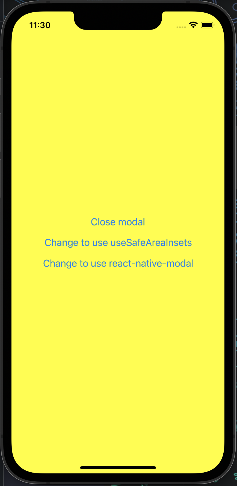
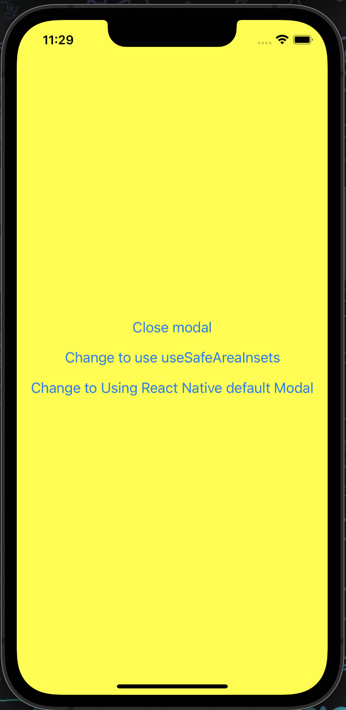
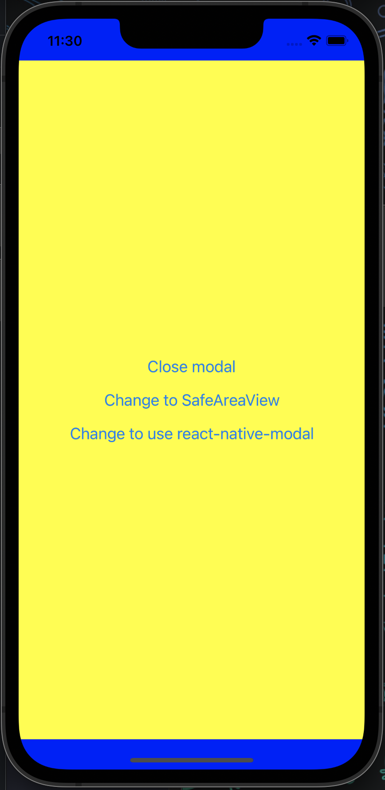

# THIS REPO WON'T MAKE SENSE

This repo is used by me to provide demo app and try to reproduce bug which I will share to better understand it.

## This branch issue

`React-Native-Safe-Area-Context`'s `ReactNativeSafeAreaView` is not working in Modal component. Affect [`react-native-modal`](https://github.com/react-native-modal/react-native-modal) too as it was base on the native Modal component,It won't apply insets. Manually applying insets using value from `useSafeAreaInsets()` hook is working.

## Screenshots and issue

## React Native's Native Modal

## react-native-modal's Modal

## Manually applying insets is working

